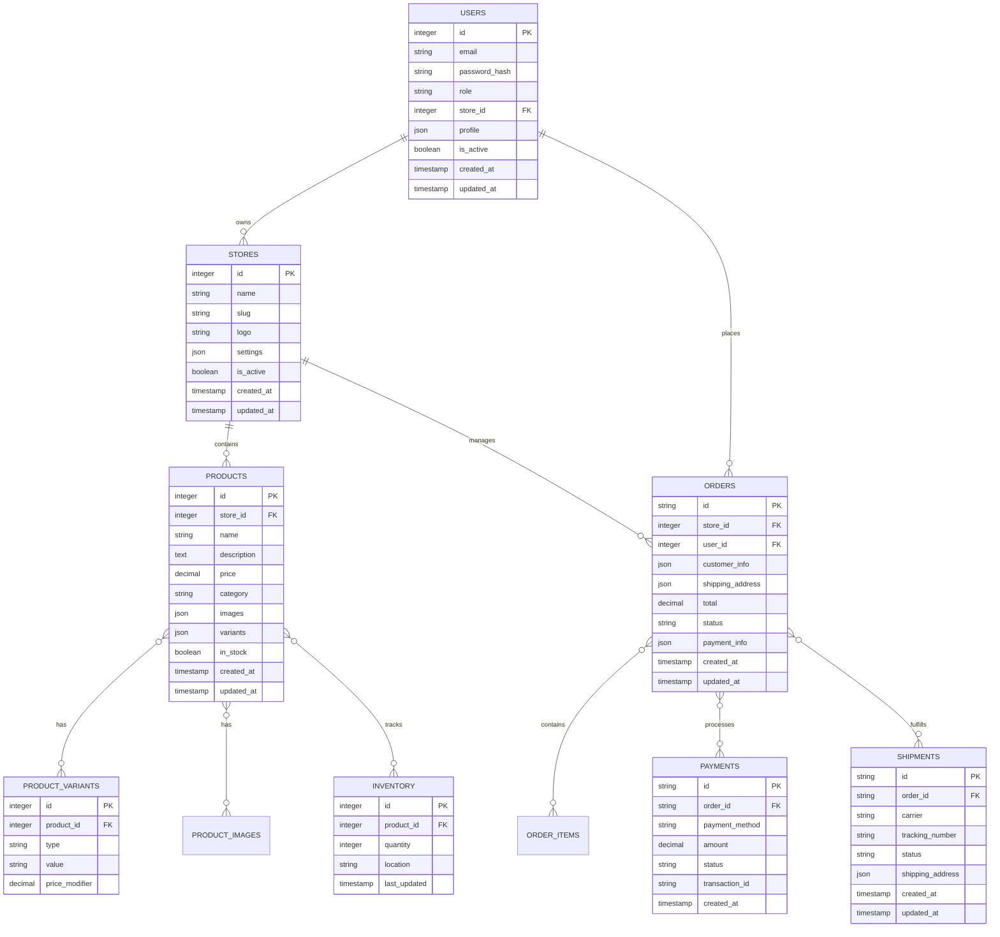

# EISHRO Platform - System Architecture Diagrams

## Overview

This document provides comprehensive visual representations of the EISHRO Platform architecture, including system components, data flow diagrams, database schemas, and integration patterns.

**Current Status (November 2025):**
- ✅ Frontend: 99% Complete
- ✅ Admin Portal: Complete
- ✅ CRM System: Complete
- ✅ Payment Integrations: Complete
- 🔄 Backend API: In Development (Next Phase)
- 🔄 Mobile App: Planned

## System Architecture Diagram

## Component Architecture Diagram

## Database Schema Diagram

## Workflow & Data Flow Diagram

## Network Architecture Diagram

## Integration Architecture Diagram

## Security Architecture Diagram

## Deployment Architecture Diagram

## Component Interaction Diagram

## Performance Architecture Diagram

## Mobile Responsiveness Diagram

## Summary

These diagrams provide a comprehensive visual representation of the EISHRO Platform's architecture, including:

### 🏗️ **System Architecture**
- Layered architecture with clear separation of concerns
- Cloud-native deployment using Cloudflare's global infrastructure
- Scalable design supporting multiple stores and high traffic

### 🗄️ **Database Design**
- Normalized schema optimized for e-commerce operations
- Support for product variants, inventory tracking, and order management
- Flexible structure for multi-store and multi-vendor operations

### 🔄️ **Workflow & Data Flow**
- Complete customer journey from discovery to completion
- Integrated admin and CRM workflows
- Comprehensive merchant management processes
- Real-time order processing and fulfillment

### 🌐 **Network Architecture**
- Global CDN distribution with Cloudflare
- Multi-layered security and load balancing
- Microservices architecture for backend services
- Automated backup and disaster recovery

### 🔄️ **Integration Patterns**
- Robust payment gateway integrations with Libyan financial institutions
- Comprehensive shipping provider network
- CRM and customer service integrations
- Admin portal for system oversight

### 🚀 **Performance Architecture**
- Mobile-first responsive design
- Edge computing for global performance
- Advanced caching and optimization strategies

### 🔒 **Security Architecture**
- Multi-layered security approach
- Payment security compliance (PCI DSS)
- Comprehensive monitoring and threat detection
- GDPR and local Libyan regulations compliance

**Current Implementation Status (November 2025):**
- ✅ Frontend: 99% Complete with full e-commerce functionality
- ✅ Admin Portal: Complete with CRM and ticket management
- ✅ Payment Integrations: Complete with Libyan gateways
- 🔄 Backend API: Next phase development
- 🔄 Mobile App: Planned for future release

This visual documentation ensures that all stakeholders understand the platform's architecture, data flow, and integration points, facilitating maintenance, scaling, and future development.